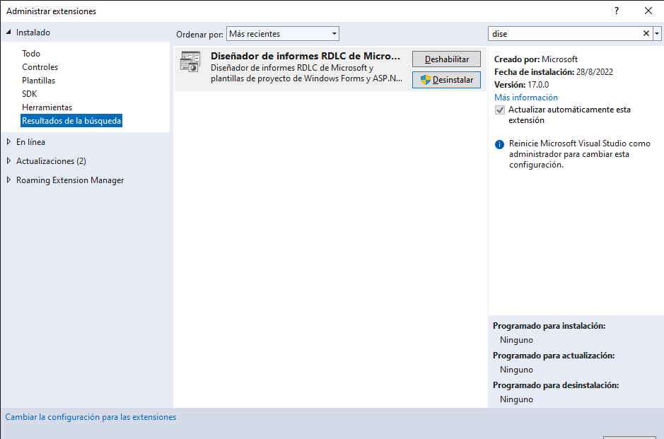
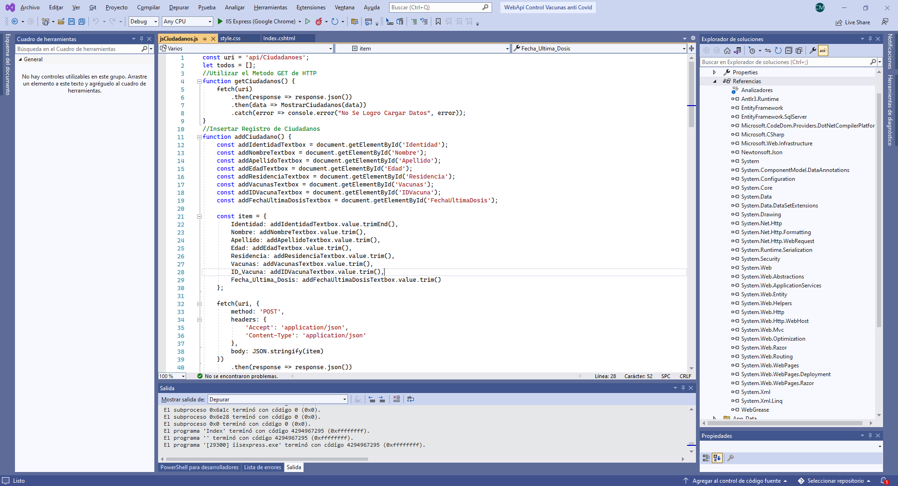
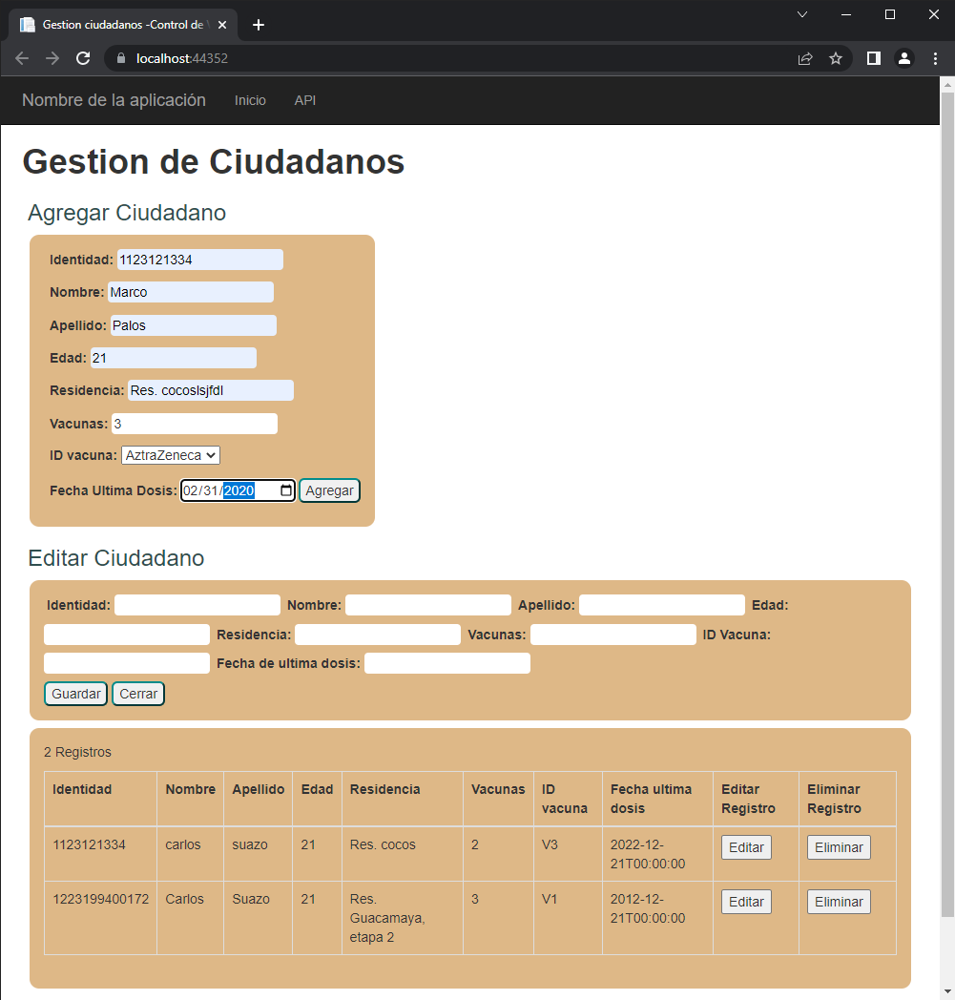

# WebApi Control Vacunas anti Covid
Proyecto desarrollado como complemento de la [aplicacion de gestion de vacunas del covid](https://github.com/sentry504/Control-Vacunas-anti-Covid) la cual permite a los ***digitadores de datos*** ingresar los datos consernientes a los ciudadanos.
## Puesta en marcha del proyecto
Pasa una copia del repositorio a tu ordenador e instala las dependencias y expenciones que se detallan a continuacion:
### Extenciones
Para este proyecto solo necesitas el **Diseñador de informes RDLC de Microsoft**

### Paquetes

### Base de datos
Busca el archivo de script .sql **Control de vacunas covid.sql** en el proyecto y ejecutalo para crear la base de datos.  
__Dato extra__ : El archivo de la base de datos de este repositorio es el mismo referenciado previamente; [aplicacion de gestion de vacunas del covid](https://github.com/sentry504/Control-Vacunas-anti-Covid)
### Preview de la API

